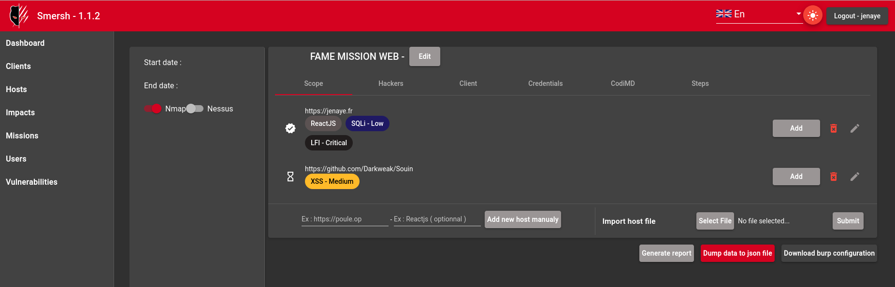
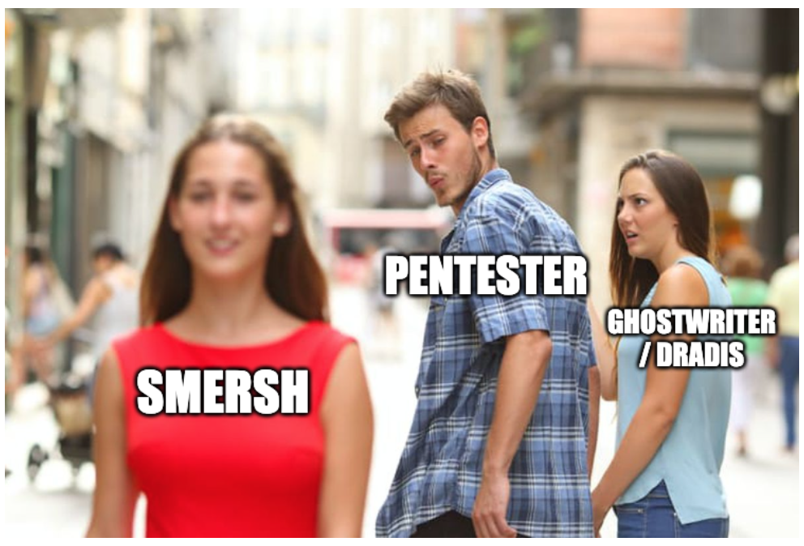

<!-- _header: "" -->
<!-- _backgroundColor: #000 -->
<!-- _color: white -->
<!-- _paginate: false -->
# Smersh

pentest oriented collaborative tool!

---

<!-- class: invert -->
<!-- _header: "" -->
<!-- _paginate: false -->
### Houziaux Mike
IT Engineer
-  Pentester @Orange Cyberdefense
-  CTF player for @Inshallack 
-  Vice-captain 0xCD
-  Open source Contributor (Symfony, rawsec)
-  Smersh tool creator
-  Engineer graduated from CNAM

*@jenaye_fr* 

---
<!-- class: invert -->
<!-- _header: "" -->
<!-- _paginate: false -->
## Summary

- Why and who created it ? 
- Technologies
- Live demo
- Features coming soon

---
<!-- _header: "" -->

---
<!-- _header: "" -->

# Contributors

---

--- 
# Features

* Atomic roles management
* Behat / Cypress tests
* Include codiMD and Bitwarden
* Vulnerabilities Database
* API (protected using JWT)
* Projet management
* Preview state of mission
* Generate report

---

---

## Smersh-cli

 command-line client

https://github.com/CMEPW/smersh-cli

`pip install smersh-cli`

---
<!-- _header: "" -->

--- 
<!-- _header: "" -->

--- 
# What's coming soon ?

* Real time notification ( Mercure )
* Password to protect mission
* Custom checkliss
* Proxy support

---
# Questions / Ideas ? 

>cmon help us ! 

* https://twitter.com/Smersh_sec
* https://github.com/CMEPW/

### Official discord (Porchetta industries)
* https://discord.gg/JVCV6ykY
